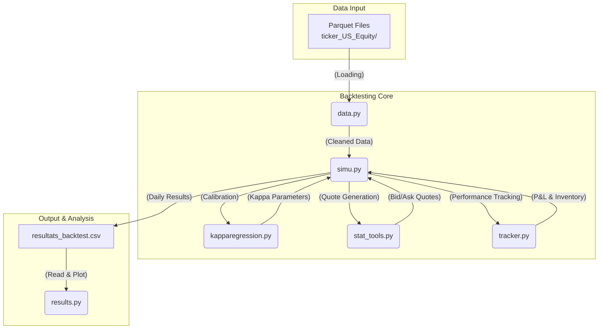

# Optimal Market Maker

This project implements an event-driven backtesting environment to simulate a Market Making strategy on US Equity markets. It integrates advanced inventory risk management and institutional-grade accounting, including funding costs.

## Project Architecture

The project is structured into several Python modules, each with a specific role:

-   **`simu.py`**: This is the main script that orchestrates the backtesting simulation. It loops through available data days, calibrates model parameters, executes the market making and hedging strategy, and saves the results.

-   **`data.py`**: Responsible for loading and cleaning raw tick-by-tick data from the `ticker_US_Equity/` directory. It prepares the data for use by the simulator.

-   **`kapparegression.py`**: Contains the logic for calibrating the parameters of the Avellaneda-Stoikov model, particularly the `kappa` parameter (an indicator of inventory risk aversion), based on daily market data.

-   **`stat_tools.py`**: Implements the `OptimalStrategy` class, which contains the core logic of the Avellaneda-Stoikov model for calculating optimal bid and ask prices based on current market conditions and inventory.

-   **`tracker.py`**: Provides the `MarketMakerPnL` class, a performance tracking tool. It records each transaction, calculates Profit & Loss (P&L) by breaking it down (spread P&L, inventory P&L), and tracks changes in inventory and cash.

-   **`results.py`**: A utility script for visualizing backtest results. It reads the `resultats_backtest.csv` file and generates interactive graphs of the strategy's performance.

-   **`requirement.txt`**: A file listing the necessary Python dependencies to run the project.

-   **`resultats_backtest.csv`**: A CSV file generated by `simu.py`, containing detailed backtest results for each simulation day.

-   **`ticker_US_Equity/`**: A directory containing raw market data, partitioned by day.

## Backtest Pipeline

The backtesting process follows these steps:

1.  **Initialization**: The `simu.py` script is launched, defining the backtest period (number of days) and strategy parameters (e.g., `gamma`, `q_bar`).

2.  **Data Loading**: For each day of the testing period, `simu.py` calls `data.py` to load the corresponding day's tick data.

3.  **Model Calibration**: Using the day's data, `kapparegression.py` is used to estimate the `kappa` parameter, thereby adapting the strategy to the day's market conditions.

4.  **Simulation Loop and Hedging**: The simulator processes market events (trades) throughout the day.
    a. For each event, the `OptimalStrategy` (`stat_tools.py`) calculates bid and ask prices (quote skewing).
    b. The simulator checks if market conditions trigger a transaction against the market maker's orders.
    c. If a transaction occurs, the `MarketMakerPnL` (`tracker.py`) is updated.
    d. After the transaction, `simu.py` checks if the inventory has exceeded the `q_bar` threshold. If so, an aggressive market order is sent to hedge the risk and bring the inventory back into the comfort zone.

5.  **Daily Results Generation**: At the end of each day, a P&L report is generated by the `tracker`, and the consolidated daily results are stored.

6.  **Saving**: Once all days are simulated, the compiled results are saved to the `resultats_backtest.csv` file.

7.  **Analysis**: The user can then run `results.py` to visualize cumulative performance, daily P&L, inventory evolution, and other key metrics.

## Architecture and Pipeline Diagram

