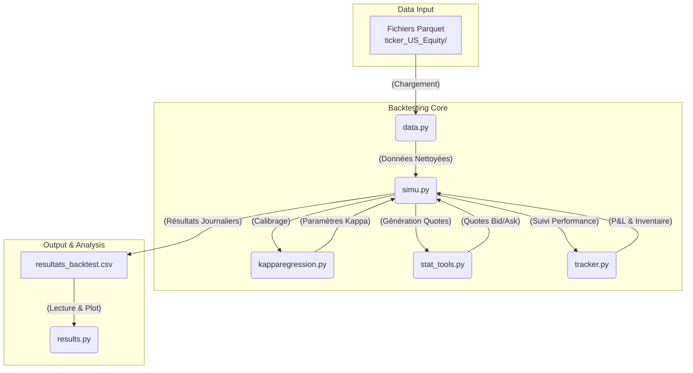

<<<<<<< Updated upstream
# Optimal-market-maker

<h1 align="center">📈 Optimal Market Making Simulator (US Equity)</h1>

<p align="center">
  
  
  
  
</p>

> **Description :** Ce projet implémente un environnement de backtesting événementiel (Event-Driven) pour simuler une stratégie de Market Making sur les marchés actions américains (US Equity). Il intègre une gestion avancée du risque d'inventaire et une comptabilité de niveau institutionnel incluant le coût de refinancement (Funding Cost).

---

<p align="center">
  <!-- Remplace le lien ci-dessous par ton propre GIF ou image une fois que tu l'auras généré -->
  
</p>

## ✨ Fonctionnalités Principales

* **Backtester Événementiel :** Simulation réaliste au niveau de la microseconde. L'automate réagit au flux (Quotes) et n'est exécuté que lorsqu'un `TRADE` réel consomme la liquidité fournie aux prix limites.
* **Comptabilité Institutionnelle (PnL) :** Décomposition stricte de la performance avec intégration du taux sans risque (SOFR) pour modéliser le coût de portage overnight.
* **Visualisation Interactive :** Rendu graphique haute résolution permettant d'inspecter l'exécution des ordres et la gestion de l'inventaire en temps réel.

---

## 📐 Modèle Mathématique (Avellaneda-Stoikov)

Le cœur de l'algorithme repose sur le contrôle stochastique pour ajuster dynamiquement le positionnement dans le carnet d'ordres. 

Le **prix de réserve** ($r$) est calculé pour décaler les cotations en fonction du risque d'inventaire ($q$) et de l'aversion au risque ($\gamma$) :
$$r = s - q\gamma\sigma^2(T-t)$$

Le **spread optimal** ($\delta$) est déterminé pour maximiser le profit tout en contrôlant la probabilité d'exécution ($k$) :
$$\delta = \gamma\sigma^2(T-t) + \frac{2}{\gamma} \ln\left(1 + \frac{\gamma}{k}\right)$$

---

## 🚀 Structure du Projet

* **`MarketMakerPnL` :** Classe dédiée au tracking de la position et au calcul du P&L (Intraday, Veille, Funding SOFR).
* **`OptimalStrategy` :** Implémentation mathématique gérant le calcul de la volatilité et le pricing dynamique des limites.
* **`run_full_backtest()` :** Moteur événementiel traitant le flux chronologique des données `.parquet`.

---

## 📊 Exemple de Résultat (Report)

En fin de journée, l'algorithme génère un rapport de P&L décomposé, séparant les gains de trading des coûts de financement du capital :

```text
--- BILAN DE CLÔTURE ---
PnL Intraday (Spread + MTM)      :   145.50 $PnL Veille (Variation de prix)   :   210.00$
  dont Coût de Financement (SOFR):  - 12.45 $
---------------------------------------------
PnL TOTAL                        :   343.05 $
Inventaire Final                 : 150 actions
=======
# Optimal Market Maker

Ce projet implémente une stratégie de market making basée sur le modèle d'Avellaneda-Stoikov, conçue pour opérer sur des données de marché haute fréquence. Il inclut un backtesteur complet pour simuler la stratégie sur des données historiques et analyser sa performance.

## Architecture du Projet

Le projet est structuré en plusieurs modules Python, chacun ayant un rôle spécifique :

-   **`simu.py`**: C'est le script principal qui orchestre la simulation de backtesting. Il boucle sur les jours de données disponibles, calibre les paramètres du modèle, exécute la stratégie et sauvegarde les résultats.

-   **`data.py`**: Responsable du chargement et du nettoyage des données brutes de tick-by-tick depuis le répertoire `ticker_US_Equity/`. Il prépare les données pour qu'elles soient exploitables par le simulateur.

-   **`kapparegression.py`**: Contient la logique pour calibrer les paramètres du modèle d'Avellaneda-Stoikov, notamment le paramètre `kappa` (indicateur de l'aversion au risque de l'inventaire), en se basant sur les données de marché de la journée.

-   **`stat_tools.py`**: Implémente la classe `OptimalStrategy` qui contient la logique principale du modèle d'Avellaneda-Stoikov pour calculer les prix d'achat (bid) et de vente (ask) optimaux en fonction de l'état du marché et de l'inventaire actuel.

-   **`tracker.py`**: Fournit la classe `MarketMakerPnL` qui est un outil de suivi de la performance. Il enregistre chaque transaction, calcule le Profit & Loss (P&L) en le décomposant (spread pnl, inventory pnl), et suit l'évolution de l'inventaire et du cash.

-   **`results.py`**: Un script utilitaire pour visualiser les résultats du backtest. Il lit le fichier `resultats_backtest.csv` et génère des graphiques interactifs de la performance de la stratégie.

-   **`requirement.txt`**: Fichier listant les dépendances Python nécessaires pour exécuter le projet.

-   **`resultats_backtest.csv`**: Fichier CSV généré par `simu.py`, contenant les résultats détaillés du backtest pour chaque jour de simulation.

-   **`ticker_US_Equity/`**: Répertoire contenant les données de marché brutes, partitionnées par jour.

## Pipeline du Backtest

Le processus de backtesting suit les étapes suivantes :

1.  **Initialisation**: Le script `simu.py` est lancé, définissant la période de backtest (nombre de jours) et les paramètres de la stratégie (ex: `gamma`).

2.  **Chargement des Données**: Pour chaque jour de la période de test, `simu.py` fait appel à `data.py` pour charger les données de ticks du jour correspondant.

3.  **Calibration du Modèle**: Avec les données du jour, `kapparegression.py` est utilisé pour estimer le paramètre `kappa`, adaptant ainsi la stratégie aux conditions de marché du jour.

4.  **Boucle de Simulation**: Le simulateur parcourt les événements de marché (trades) de la journée.
    a. Pour chaque événement, la `OptimalStrategy` (`stat_tools.py`) calcule les prix de bid et d'ask.
    b. Le simulateur vérifie si les conditions de marché déclenchent une transaction contre les ordres du market maker.
    c. Si une transaction a lieu, le `MarketMakerPnL` (`tracker.py`) est mis à jour (cash, inventaire, P&L).

5.  **Génération des Résultats Journaliers**: À la fin de chaque journée, un rapport de P&L est généré par le `tracker` et les résultats consolidés de la journée sont stockés.

6.  **Sauvegarde**: Une fois tous les jours simulés, les résultats compilés sont sauvegardés dans le fichier `resultats_backtest.csv`.

7.  **Analyse**: L'utilisateur peut ensuite exécuter `results.py` pour visualiser la performance cumulée, le P&L journalier, l'évolution de l'inventaire, et d'autres métriques clés.

## Schéma de l'Architecture et Pipeline


>>>>>>> Stashed changes
